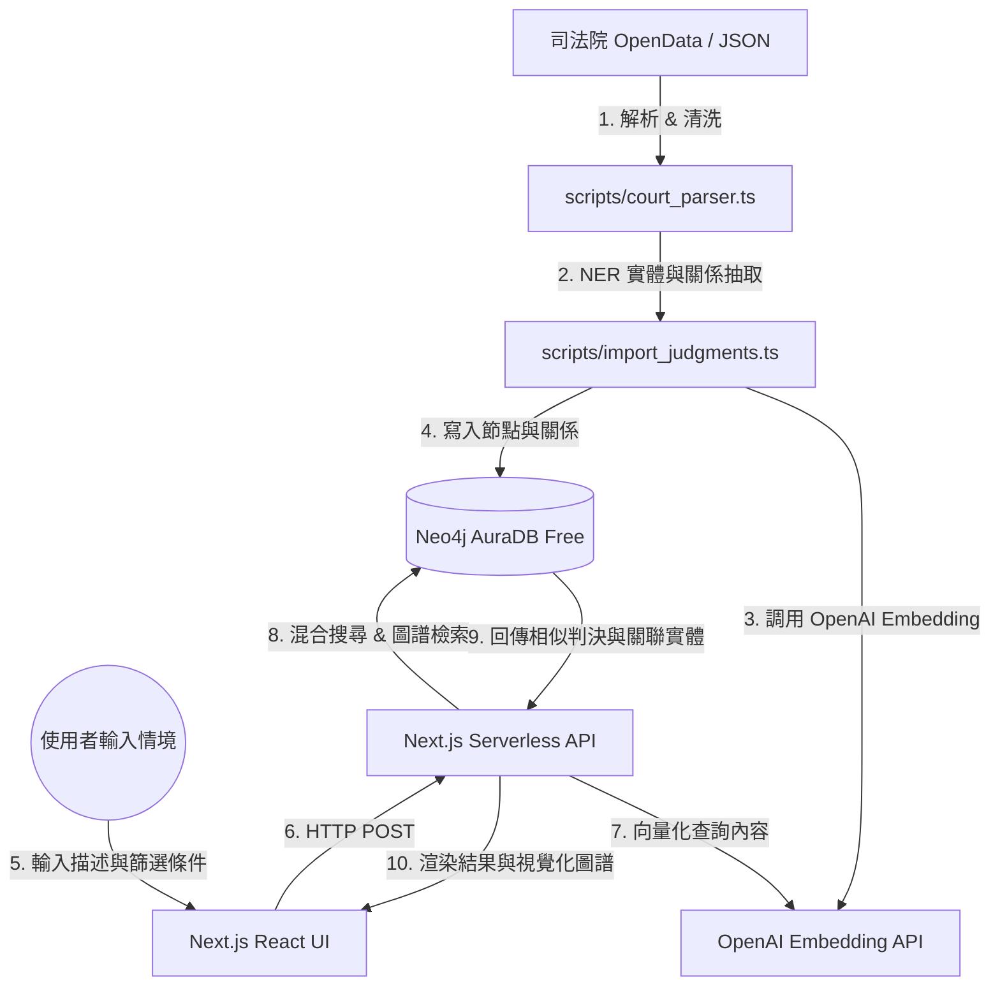

# 臺灣法律判決書 Graph RAG 搜尋系統 (Taiwan Judgment Search)

本專案是一個結合**語意向量檢索 (Vector Search)**與**圖資料庫知識圖譜 (Neo4j)**的智慧型法律判決書搜尋與分析系統。使用者能以自然語言描述特定的法律情境，系統會通過語意比對與圖譜關係檢索出最相似的判決，並提供判決關聯的實體（被告、法官、引用法條、罪名）之視覺化圖譜分析。

---

## 🚀 核心功能
* **語意與篩選混合檢索 (Hybrid Search)**：支援自然語言情境描述（如「被告酒後騎車撞傷行人並逃逸」），結合法院層級（最高法院、高等法院、地方法院）等多重條件進行篩選，並支援指定法院、法官與引用法規的硬約束過濾。
* **知識圖譜關聯分析 (Graph Analytics)**：擷取判決書中的重要實體（被告、法官、引用法條、涉及罪名）並在 Neo4j 中建立多維關係，分析相似判決書的共同引用特徵。
* **互動式圖譜視覺化與懶加載**：前端採用 `vis-network` 動態渲染圖譜。支援**雙擊任何節點非同步展開二跳關係**（二跳相似推薦案件、法規引用案件、人物參與案件），並提供酷炫的動態發散物理動畫。
* **Redis 高效快取層**：串接 **Upstash Redis** (或 Local Docker Redis)，自動將相同搜尋條件的結果進行 MD5 雜湊快取 (3天 TTL)，並在 API 層提供秒級的 Failover 降級容錯。
* **0 元雲端部署策略**：
  * **前端與 API 路由**：Vercel (Next.js) Serverless API，無須獨立 Python 後端。
  * **圖資料庫**：Neo4j AuraDB Free（免費提供 20 萬節點與 40 萬關係）。
  * **快取層**：Upstash Redis Free Tier (0 元雲端快取)。
  * **向量與 LLM 服務**：整合 OpenAI API (Embedding & LLM)。

---

## 📐 系統架構與資料流



---

## 🗂️ 圖譜資料模型 (Neo4j Schema)

> [!NOTE]
> 本專案目前採用**段落級向量化 (Section-level Embedding)** 設計。由於判決書全文通常極長，分段儲存向量能提供更精準的語意相似度檢索，並避免 OpenAI API 的 Token 長度限制。

### 1. 核心節點類型 (Node Labels)
* **`Judgment` (判決書)**:
  * `id`: 判決字號 / 系統 ID (String, 具 Unique Constraint)
  * `case_type`: 案件大類，如 `民事`、`刑事`、`行政` (String)
  * `court`: 法院名稱，如 `臺灣臺北地方法院` (String)
  * `court_level`: 法院層級，如 `地方法院`、`高等法院`、`最高法院` (String)
  * `date`: 判決日期 (Date)
  * `reason`: 案由 / 案名，如 `公共危險` (String)
  * `main_text`: 判決主文 (String)
  * `fact_reason`: 事實及理由全文 (String)
* **`Section` (判決書分段)**:
  * `id`: 段落唯一識別碼，格式為 `${JID}_sec_${index}` (String, 具 Unique Constraint)
  * `index`: 段落順序索引 (Integer)
  * `role`: 段落發言角色，如 `court`, `plaintiff`, `defendant` (String)
  * `type`: 段落類型，如 `facts`, `reasoning` (String)
  * `text`: 段落文字內容 (String)
  * `embedding`: 段落文字之 1536 維向量值 (Vector, 對應 `section_embedding_index`)
* **`Person` (相關人名)**:
  * `name`: 姓名 (String, 具 Unique Constraint)
* **`Law` (引用法規)**:
  * `name`: 法條完整名稱，如 `中華民國刑法第185-3條` (String, 具 Unique Constraint)

### 2. 關係類型 (Relationship Types)
* `(:Judgment)-[:HAS_SECTION {index: Integer}]->(:Section)`：判決書與其拆分段落之關聯。
* `(:Judgment)-[:JUDGED_BY]->(:Person)`：裁判法官。
* `(:Judgment)-[:DEFENDANT]->(:Person)`：案件被告。
* `(:Judgment)-[:PLAINTIFF]->(:Person)`：案件原告。
* `(:Judgment)-[:REPRESENTED_BY]->(:Person)`：訴訟代理人 / 選任辯護人。
* `(:Judgment)-[:CITED]->(:Law)`：引用的法條。

---

## 📂 專案目錄結構

```
.
├── .agents/                    # AI Agent 行為限制與自訂規則 (Antigravity 專用)
├── .env.example                # 環境變數範例模板
├── AGENTS.md                   # 專案通用 AI 開發指引 (所有協同 AI 必讀)
├── docker-compose.yml          # 本地 Neo4j 資料庫容器配置 (預設連接 Bolt: 7687)
├── package.json                # 根目錄指令代理設定 (NPM Scripts)
├── openspec/                   # 專案規格管理目錄 (OpenSpec)
│   ├── specs/                  # 現行正式功能規格書 (Living Specifications)
│   └── changes/                # 提案變更目錄 (包含開發中與待討論的 WIP)
│       ├── archive/            # 已完工並結案的歷史變更封存
│       ├── wip-graph-and-algorithms/ # [WIP] 知識圖譜 Schema 擴充與演算法優化
│       ├── wip-frontend-and-ux/      # [WIP] 前端進階搜尋與 vis.js 效能優化
│       └── wip-pipeline-and-ops/     # [WIP] 資料流水線與連線池維運優化
├── frontend/                   # 全端 Next.js 前端應用與 TypeScript 腳本
│   ├── src/
│   │   ├── app/                # Next.js 頁面與 API 路由 (Serverless Route Handlers)
│   │   ├── components/         # React UI 元件與 vis-network 圖譜繪製元件
│   │   └── scripts/            # 重構後的資料處理、LPA 社群偵測與匯入腳本 (TypeScript)
│   │       ├── test_neo4j_connection.ts # 測試 Neo4j 資料庫連線狀態
│   │       ├── import_sample.ts   # 隨機按比例抽樣並匯入判決書資料
│   │       ├── import_judgments.ts# 解析並匯入全量判決書的實體與關係
│   │       ├── community_detection.ts # 本地 LPA 標籤傳播社群偵測演算法
│   │       ├── update_embeddings.ts # 補全未向量化之 Chunks
│   │       ├── verify_db.ts       # 資料庫數據統計驗證腳本
│   │       └── search_pipeline.ts # 命令行測試用混合搜尋 CLI
│   ├── package.json            # 前端相依套件與指令設定
│   └── tailwind.config.ts      # Tailwind CSS 樣式配置
└── data/                       # 原始判決書資料存放目錄
```

---

## 🛠️ 快速開始

### 步驟 1：複製並設定環境變數
In the root directory, copy the environment variable example:
```bash
cp .env.example frontend/.env.local
```
編輯 `frontend/.env.local` 檔案，填入您的 **Neo4j AuraDB** 連線資訊、**OpenAI API Key**，以及 **Upstash Redis** 連線參數（若本機測試不使用 Redis，可將 `USE_REDIS` 設為 `false`）：
```env
USE_REDIS=true
REDIS_HOST=your-upstash-redis-host
REDIS_PORT=6379
REDIS_PASSWORD=your-redis-password
```

### 步驟 2：安裝 Node 依賴套件
在專案根目錄下，進入 `frontend` 目錄並安裝所有依賴（包含編譯與執行 TS 腳本需要的 `tsx` 和 `dotenv`）：
```bash
cd frontend
npm install
```

### 步驟 3：初始化 Neo4j 與匯入資料 (TypeScript)
您可以在專案**根目錄**直接執行以下代理指令（免去 `cd` 切換目錄）：

1. **測試資料庫連線**：
   ```bash
   npm run db:connect-test
   ```
2. **執行資料抽樣與匯入 (預設抽樣 10,000 筆，並行度為 5)**：
   ```bash
   npm run db:import-sample
   ```
   *(您也可以限制只匯入前 5 筆進行快速測試：`npm run db:import-sample -- --limit 5`)*
3. **執行 LPA 社群偵測著色**：
   ```bash
   npm run db:community
   ```
4. **補全 Chunk 的向量 Embedding**：
   ```bash
   npm run db:update-embeddings
   ```
5. **資料庫數據統計驗證**：
   ```bash
   npm run db:verify
   ```
6. **清空 Redis 快取數據**：
   ```bash
   npm run db:flush-redis
   ```

### 步驟 4：啟動 Web 搜尋介面 (Next.js 前端)
在專案根目錄下直接執行：
```bash
npm run dev
```
造訪 [http://localhost:3000](http://localhost:3000) 即可進入搜尋與視覺化圖譜系統。

---

## 📅 開發中與待討論事項 (Roadmap / WIP)

本專案的待辦功能與未來優化事項已全面遷移至 **OpenSpec 變更提案** 中進行管理。這能確保所有協同開發的 AI 助理能精確讀取並追蹤最新任務狀態。

目前進行中與待討論的 WIP 分類提案如下：
1. **[知識圖譜與向量演算法優化](file:///c:/PythonSideProjects/判決書搜尋系統/openspec/changes/wip-graph-and-algorithms/)**：包含罪名/事證 Schema 擴充、圖譜硬約束過濾、多跳推理檢索、檢索評估測試集與中文斷詞器優化。
2. **[增量導入資料流水線與連線池維運優化](file:///c:/PythonSideProjects/判決書搜尋系統/openspec/changes/wip-pipeline-and-ops/)**：包含全量資料重新向量化、連線池交易重試優化、Supabase 佇列控流增量同步流水線與同步監控儀表板。

> [!TIP]
> 協同開發 AI 助理（如 Cursor, Claude Code, Codex）將會自動讀取上述路徑中的 `proposal.md` 與 `tasks.md` 以獲取下一步的具體開發任務，請勿直接修改此 README 中的 WIP 說明。
