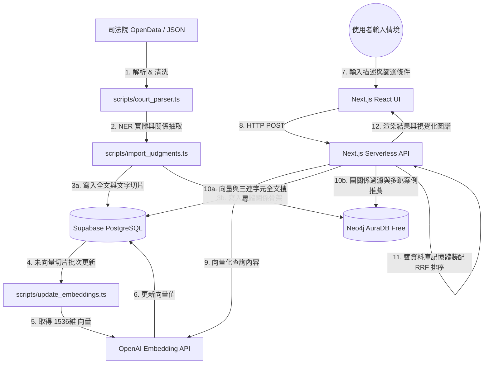

# 臺灣法律判決書 Graph RAG 搜尋系統 (Taiwan Judgment Search)

本專案是一個結合 **PostgreSQL 關係與向量資料庫**、與 **Neo4j 圖資料庫知識圖譜** 的智慧型法律判決書搜尋與分析系統（採用 **圖文分離 Polyglot Decoupling** 架構）。使用者能以自然語言描述特定的法律情境，系統會通過語意比對與圖譜關係檢索出最相似的判決，並提供判決關聯的實體（被告、原告、法官、引用法條、罪名、關鍵事證）之視覺化圖譜分析。

---

## 🚀 核心功能
* **圖文分離 (Polyglot Decoupling) 雙庫檢索**：
  * **PostgreSQL (Supabase)**：高效儲存切片文字與 1536 維向量（pgvector），提供極速 HNSW 向量檢索與 Trigram 中文模糊全文檢索。
  * **Neo4j AuraDB**：專注儲存實體邊關係骨架，免去大量長文本節點，徹底解決 AuraDB Free 20 萬節點容量上限。
* **語意與篩選混合檢索 (Hybrid Search)**：支援自然語言情境描述（如「被告酒後騎車撞傷行人並逃逸」），結合法院層級（最高法院、高等法院、地方法院）等多重條件進行篩選，並支持指定法院、法官與引用法規的關係硬約束過濾。
* **知識圖譜關聯分析 (Graph Analytics)**：擷取判決書中的重要實體（被告、原告、法官、引用法條、罪名、關鍵事證）並在 Neo4j 中建立多維關係，分析相似判決書的共同引用特徵。
* **互動式圖譜視覺化與懶加載**：前端採用 `vis-network` 動態渲染圖譜。支援**雙擊任何節點非同步展開二跳關係**（二跳相似推薦案件、法規引用案件、人物參與案件），並提供酷炫的動態發散物理動畫。
* **Redis 高效快取層**：串接 **Upstash Redis**，自動將相同搜尋條件的結果進行 MD5 雜湊快取 (3天 TTL)，並在 API 層提供秒級的 Failover 降級容錯。
* **0 元雲端部署策略**：
  * **前端與 API 路由**：Vercel (Next.js) Serverless API，連接 Postgres 與 Neo4j 實現 0 元部署。

---

## 📐 系統架構與資料流



---

## 🗂️ 資料庫資料模型設計

### 1. PostgreSQL Schema (儲存全文與向量)
* **`judgments` (主表)**：儲存判決書基本 metadata、`main_text` (主文)、`fact_reason` (事實及理由全文)。建立 `gin_trgm_ops` 索引以提供 GIN 全文模糊檢索加速。
* **`sections` (段落表)**：儲存拆分後的段落結構與角色標記（原告主張、被告抗辯、法院見解等）。
* **`chunks` (切片表)**：儲存文字切片，並配置 `embedding` 欄位為 `VECTOR(1536)` (使用 HNSW 索引搭配 `vector_cosine_ops` 進行向量 Cosine 快速檢索)。

### 2. Neo4j Schema (儲存拓撲結構)
* **`Judgment` (判決骨架)**：`id` (PK), `court`, `court_level`, `case_type`, `date`, `reason` (無長文本，無向量，減輕 90% 儲存負擔)。
* **`Entity` (關聯實體)**：
  * **`Person`**：法官、被告、原告、訴訟代理人。
  * **`Law`**：引用法條，如 `中華民國刑法第185-3條`。
  * **`Crime`**：涉及罪名，如 `公共危險`、`過失傷害`（由 NER 模組自動抽取）。
  * **`Item`**：關鍵事證，如 `呼氣酒精濃度`、`安非他命`、`西瓜刀`（由 NER 模組自動抽取）。
* **關係線**：
  * `(:Judgment)-[:JUDGED_BY]->(:Person)` (裁判法官)
  * `(:Judgment)-[:DEFENDANT]->(:Person)` (被告人)
  * `(:Judgment)-[:CITED]->(:Law)` (引用法條)
  * `(:Judgment)-[:CHARGED_WITH]->(:Crime)` (涉及罪名)
  * `(:Judgment)-[:FOUND_WITH]->(:Item)` (涉及關鍵事證)
  * `(:Judgment)-[:SIMILAR_TO {score: Float}]->(:Judgment)` (共享法規二跳推薦關係)

---

## 📂 專案目錄結構
```
.
├── AGENTS.md                   # 專案通用 AI 開發指引 (所有協同 AI 必讀)
├── docker-compose.yml          # 本地 Neo4j 資料庫容器配置 (預設連接 Bolt: 7687)
├── package.json                # 根目錄指令代理設定 (NPM Scripts)
├── openspec/                   # 專案規格管理目錄 (OpenSpec)
│   └── changes/archive/        # 已完工並結案的歷史變更封存
├── frontend/                   # 全端 Next.js 前端應用與 TypeScript 腳本
│   ├── src/
│   │   ├── app/                # Next.js 頁面與 API 路由 (Serverless Route Handlers)
│   │   ├── components/         # React UI 元件與 vis-network 圖譜繪製元件
│   │   ├── lib/
│   │   │   ├── postgres.ts     # Postgres 單例連線池快取模組
│   │   │   └── redis.ts        # Redis 連線快取
│   │   └── scripts/            # 重構後的資料處理、LPA 社群偵測與匯入腳本 (TypeScript)
│   │       ├── init_postgres.ts   # 初始化 PostgreSQL 表、向量與三連字元索引
│   │       ├── evaluate_search.ts # 自動建立黃金測試集評估 Recall@K 指標
│   │       ├── import_sample.ts   # 隨機按比例抽樣並匯入判決書資料
│   │       ├── import_judgments.ts# 解析並雙寫匯入判決書的實體與全文
│   │       ├── community_detection.ts # 本地 LPA 標籤傳播社群偵測演算法
│   │       ├── update_embeddings.ts # 補全未向量化之 Chunks (Postgres 版)
│   │       ├── verify_db.ts       # 資料庫數據統計驗證腳本
│   │       └── search_pipeline.ts # 命令行測試用混合搜尋 CLI
│   ├── package.json            # 前端相依套件與指令設定
│   └── tailwind.config.ts      # Tailwind CSS 樣式配置
└── data/                       # 原始判決書資料存放目錄
```

---

## 🛠️ 快速開始

### 步驟 1：複製並設定環境變數
在專案根目錄下，複製環境變數範例：
```bash
cp .env.example frontend/.env.local
```
編輯 `frontend/.env.local` 檔案，填入您的 **Neo4j AuraDB**、**OpenAI API Key**、**Upstash Redis**，以及新版 **PostgreSQL (Supabase) 連線字串** `DATABASE_URL`。
> [!TIP]
> 如果您的資料庫密碼中包含 `@`, `/`, `$`, `%` 等特殊字元，請務必先將密碼進行 **URL 編碼** (例如 `@` 轉為 `%40`，`$` 轉為 `%24`)，以防 PostgreSQL 用戶端解析錯誤。

### 步驟 2：安裝 Node 依賴套件
```bash
cd frontend
npm install
```

### 步驟 3：初始化資料庫與匯入資料 (TypeScript)
您可以在專案**根目錄**直接執行以下代理指令：

1. **初始化 PostgreSQL 資料表與 GIN/HNSW 索引**：
   ```bash
   npm run db:init-postgres
   ```
2. **過濾車禍相關案件並雙寫匯入資料庫**：
   ```bash
   npx tsx src/scripts/import_judgments.ts --dir ../data/202604 --only-accidents
   ```
3. **執行 LPA 社群偵測著色**：
   ```bash
   npm run db:community
   ```
4. **補全 Chunk 的向量 Embedding**：
   ```bash
   npm run db:update-embeddings
   ```
5. **執行搜尋演算法召回率品質評估 (Recall@K)**：
   ```bash
   npm run db:evaluate
   ```

### 步驟 4：啟動 Web 搜尋介面 (Next.js 前端)
在專案根目錄下直接執行：
```bash
npm run dev
```
造訪 [http://localhost:3000](http://localhost:3000) 即可進入搜尋與視覺化圖譜系統。
