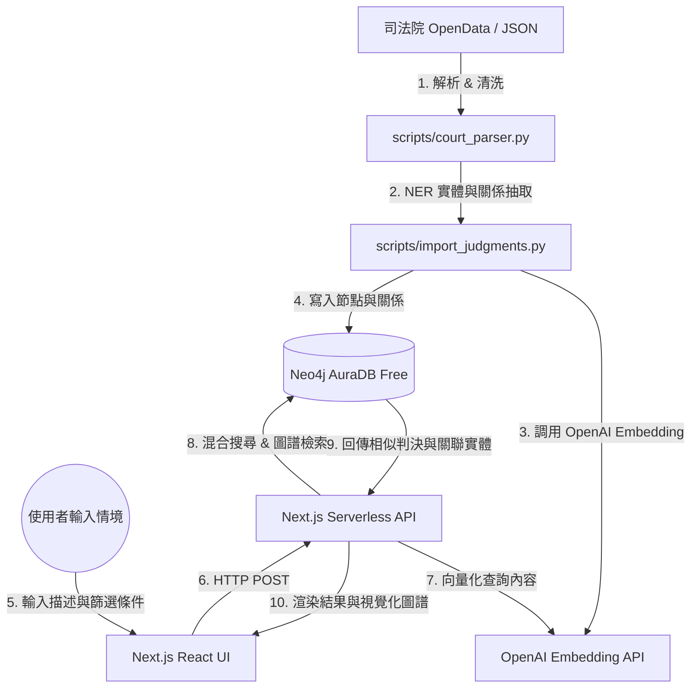

# 臺灣法律判決書 Graph RAG 搜尋系統 (Taiwan Judgment Search)

本專案是一個結合**語意向量檢索 (Vector Search)**與**圖資料庫知識圖譜 (Neo4j)**的智慧型法律判決書搜尋與分析系統。使用者能以自然語言描述特定的法律情境，系統會通過語意比對與圖譜關係檢索出最相似的判決，並提供判決關聯的實體（被告、法官、引用法條、罪名）之視覺化圖譜分析。

---

## 🚀 核心功能
* **語意與篩選混合檢索 (Hybrid Search)**：支援自然語言情境描述（如「被告酒後騎車撞傷行人並逃逸」），結合法院層級（最高法院、高等法院、地方法院）等多重條件進行篩選。
* **知識圖譜關聯分析 (Graph Analytics)**：擷取判決書中的重要實體（被告、法官、引用法條、涉及罪名）並在 Neo4j 中建立多維關係，分析相似判決書的共同引用特徵。
* **互動式圖譜視覺化**：前端採用 Next.js + React 搭配 `vis-network`，實現判決關聯圖譜的動態呈現、節點拖曳互動與社群偵測（Community Detection）分群著色。
* **0 元雲端部署策略**：
  * **前端與 API 路由**：Vercel (Next.js) Serverless API，無須獨立 Python 後端。
  * **圖資料庫**：Neo4j AuraDB Free（免費提供 20 萬節點與 40 萬關係）。
  * **向量與 LLM 服務**：整合 OpenAI API (Embedding & LLM)。

---

## 📐 系統架構與資料流



---

## 🗂️ 圖譜資料模型 (Neo4j Schema)

> [!NOTE]
> 本專案目前採用**段落級向量化 (Section-level Embedding)** 設計。由於判決書全文通常極長，分段儲存向量能提供更精準的語意相似度檢索，並避免 OpenAI API 的 Token 長度限制。

### 1. 核心節點類型 (Node Labels)
* **`Judgment` (判決書)**:
  * `id`: 判決字號 / 系統 ID (String, 具 Unique Constraint)
  * `case_type`: 案件大類，如 `民事`、`刑事`、`行政` (String)
  * `court`: 法院名稱，如 `臺灣臺北地方法院` (String)
  * `court_level`: 法院層級，如 `地方法院`、`高等法院`、`最高法院` (String)
  * `date`: 判決日期 (Date)
  * `reason`: 案由 / 案名，如 `公共危險` (String)
  * `main_text`: 判決主文 (String)
  * `fact_reason`: 事實及理由全文 (String)
* **`Section` (判決書分段)**:
  * `id`: 段落唯一識別碼，格式為 `${JID}_sec_${index}` (String, 具 Unique Constraint)
  * `index`: 段落順序索引 (Integer)
  * `role`: 段落發言角色，如 `court`, `plaintiff`, `defendant` (String)
  * `type`: 段落類型，如 `facts`, `reasoning` (String)
  * `text`: 段落文字內容 (String)
  * `embedding`: 段落文字之 1536 維向量值 (Vector, 對應 `section_embedding_index`)
* **`Person` (相關人名)**:
  * `name`: 姓名 (String, 具 Unique Constraint)
* **`Law` (引用法規)**:
  * `name`: 法條完整名稱，如 `中華民國刑法第185-3條` (String, 具 Unique Constraint)

### 2. 關係類型 (Relationship Types)
* `(:Judgment)-[:HAS_SECTION {index: Integer}]->(:Section)`：判決書與其拆分段落之關聯。
* `(:Judgment)-[:JUDGED_BY]->(:Person)`：裁判法官。
* `(:Judgment)-[:DEFENDANT]->(:Person)`：案件被告。
* `(:Judgment)-[:PLAINTIFF]->(:Person)`：案件原告。
* `(:Judgment)-[:REPRESENTED_BY]->(:Person)`：訴訟代理人 / 選任辯護人。
* `(:Judgment)-[:CITED]->(:Law)`：引用的法條。

---

## 📂 專案目錄結構

```
.
├── .agents/                    # AI Agent 開發指引與設定檔
├── .env.example                # 環境變數範例模板
├── AGENTS.md                   # 法律判決書 Graph RAG 開發指引 (世界觀與限制說明)
├── docker-compose.yml          # 本地 Neo4j 資料庫容器配置 (預設連接 Bolt: 7687)
├── requirements-key-packages.txt # Python 後端核心套件清單
├── scripts/                    # 資料處理、NER 解析與圖譜匯入腳本 (Python)
│   ├── test_neo4j_connection.py# 測試 Neo4j 資料庫連線狀態
│   ├── import_sample.py        # 匯入範例判決資料與建立向量索引
│   ├── import_judgments.py     # 解析並匯入判決書的 NER 實體與關係
│   ├── community_detection.py  # 執行社群偵測演算法進行圖譜聚類著色
│   └── search_ui.py            # 本地端測試使用的 Gradio/Streamlit 搜尋介面
├── frontend/                   # 全端 Next.js 前端應用
│   ├── src/
│   │   ├── app/                # Next.js 頁面與 API 路由 (Serverless Route Handlers)
│   │   └── components/         # React UI 元件與 vis-network 圖譜繪製元件
│   ├── package.json            # 前端相依套件與指令設定
│   └── tailwind.config.ts      # Tailwind CSS 樣式配置
└── data/                       # 原始判決書資料存放目錄
```

---

## 🛠️ 快速開始

### 步驟 1：複製並設定環境變數
在專案根目錄下複製環境變數範例：
```bash
cp .env.example .env
```
編輯 `.env` 檔案，填入您的 **Neo4j AuraDB** 或本地 Neo4j 連線資訊，以及 **OpenAI API Key**。

同時也需要在 `frontend/` 目錄下建立 `.env.local` 供 Next.js 讀取：
```bash
cp .env.example frontend/.env.local
```

### 步驟 2：初始化 Neo4j 與匯入資料 (Python)
1. **安裝 Python 依賴套件**：
   ```bash
   pip install -r requirements-key-packages.txt
   ```
2. **測試資料庫連線**：
   ```bash
   python scripts/test_neo4j_connection.py
   ```
3. **執行資料匯入與向量索引建立**：
   ```bash
   python scripts/import_sample.py
   ```

### 步驟 3：啟動 Web 搜尋介面 (Next.js 前端)
1. **進入前端目錄並安裝 Node 依賴**：
   ```bash
   cd frontend
   npm install
   ```
2. **啟動開發伺服器**：
   ```bash
   npm run dev
   ```
3. **開啟瀏覽器**：
   造訪 [http://localhost:3000](http://localhost:3000) 即可進入搜尋與視覺化圖譜系統。

---

## 📅 開發中與待討論事項 (Roadmap / WIP)

以下是根據專案規格文件與實際原始碼（數據導入腳本、搜尋管線與前端 API）比對後，整理出**目前尚未完整實作**、**代碼中有待優化**或**未來待討論修正**的重點清單：

### 1. 知識圖譜 Schema 擴充與 NER 優化
* [ ] **罪名實體抽取 (`:Crime` 節點)**：評估是否應從判決主文或案由中，以 NER 抽取具體罪名（如 `公共危險罪`、`過失傷害罪`），並建立 `(:Judgment)-[:CHARGED_WITH]->(:Crime)` 關係。
* [ ] **關鍵事證抽取 (`:Item` 節點)**：規劃擷取關鍵犯罪工具或事證（如 `呼氣酒精濃度`、`凶器`、`毒品重量`），建立 `(:Judgment)-[:INVOLVES]->(:Item)` 關係以提升語意檢索深度。
* [ ] **多重標籤繼承 (`:Entity` 標籤)**：評估是否讓 `Person`、`Law`、`Crime` 節點統一繼承 `Entity` 標籤（例如同時標記為 `(:Entity:Person)`），以利於進行圖譜全局檢索。

### 2. 向量搜尋與圖譜推理演算法
* [ ] **判決書相似度關係 (`:SIMILAR_TO` 關係)**：研議是否在後端計算 Judgment 之間的向量相似度，並在圖資料庫中建立 `(:Judgment)-[:SIMILAR_TO {score: Float}]->(:Judgment)` 關係，以加速關聯推薦。
* [x] **段落向量索引命名對齊**：目前實際代碼使用 `section_embedding_index`，而規格書規劃為 `section_vector_index`，待後續統一命名規範。
* [x] **段落文字分塊與重疊度 (Chunk Size & Overlap) 參數調優**：目前 `judgment_splitter.py` 的分塊切分邏輯是固定規則，未來應實驗不同的 Chunk Size 與 Overlap 大小，以評估對向量搜尋召回率 (Recall) 的影響。
* [ ] **OpenAI Embedding 快取機制與成本控管**：於資料庫中實作向量 Embedding 快取（如於 Supabase 中建立 Cache 表），避免重複的情境查詢與重複導入時重複呼叫 OpenAI API，降低 API 呼叫成本並加速搜尋響應時間（快取命中時預估 <10ms）。

### 3. 系統維運與資料流水線 (Pipeline & Ops)
* [ ] **全量判決書資料之 Chunking 與 Embedding 更新**：目前程式碼已全面支援新版階層式分塊架構，但資料庫中既有的歷史判決書尚未進行全量重新切分（Chunking）與向量補全（Embedding）之覆蓋更新。
* [ ] **社群偵測自動化更新**：目前 `community_detection.py` 需手動執行，未來應規劃為與資料匯入流水線整合（如每當新資料匯入達到一定數量時自動觸發，或以 Cron Job 定期執行）。
* [ ] **環境變數同步腳本**：目前根目錄的 `.env` (Python 使用) 與 `frontend/.env.local` (Next.js 使用) 需手動同步，可開發一個一鍵同步/產生環境變數的輔助腳本。
* [ ] **AuraDB 連線池與交易重試優化**：重構至 Node.js 後，寫入事務應改用 Neo4j Driver 的 `executeWrite()` 自動重試事務封裝，以應對高併發下免費版 AuraDB 易觸發的 `Forseti Deadlock`（死結）與連線溢出問題。

### 4. 前端進階搜尋與 UI 升級
* [ ] **多條件複合篩選 (Advanced Filter)**：前端 UI 進一步整合法院別、審判法官、特定法規等複合式查詢條件。
* [ ] **法規共現分析與視覺化**：在 vis-network 圖譜中，針對同時被多個判決書引用的法條進行視覺化高亮。

### 5. 前端視覺化與效能優化 (Frontend UX & Performance)
* [ ] **圖譜節點懶加載 (Lazy Loading)**：目前的 vis-network 會一次性渲染檢索出的所有關係節點，當資料量大時可能造成 UI 卡頓。應優化為「僅預設渲染核心節點，點擊後才非同步撈取二跳關係」。

### 6. 長遠架構與擴充性挑戰 (Architecture & Scaling)
* [ ] **免費版 AuraDB 節點上限突破**：目前因受限於 AuraDB Free 的 20 萬節點與 40 萬關係上限，僅能處理約 1 萬筆判決。後續應考慮：
  * 使用 Docker 在本地或私有雲端部署 Neo4j 社群版（無數量限制）。
  * 實施更精準的高價值判決抽樣過濾機制（例如僅保留特定罪名或具代表性之上訴判決）。
* [ ] **發揮真實的 GraphRAG 推理與硬約束過濾能力**：目前檢索仍主要依賴 Vector 與 Full-Text 搜尋，圖譜僅用於呈現周邊實體。後續應引入圖結構邏輯以實現以下場景：
  * **A. 實體與屬性的硬約束過濾 (Entity & Verdict Filtering)**：在向量搜尋召回 Top 50 候選案件後，利用圖譜結構進行邏輯過濾。例如：僅保留「判決結果為無罪」且實體中包含「過失傷害罪」與「特定法條」的交集案件，實現「向量負責相似度，圖譜負責精確約束」。
  * **B. 判決脈絡的多跳推理探索 (Multi-hop Case Reasoning)**：當向量定位到某一相似判決 A，系統能沿著 Edges 自動推薦二跳、三跳的關聯脈絡。例如：「判決 A 引用了最高法院 XX 年判例，在過去半年內還有其他 3 篇判決也引用了該判例，已自動為您關聯呈現」。
  * **C. 法官裁決心證與傾向分析 (Judge Heart-證 & Sentencing Analytics)**：開發統計 API，分析特定法規在特定法官下的歷史判決倾向（例如：「在處理此類相似犯罪情境時，X 法官在過去 10 個相似案件節點中，有 8 次判決原告敗訴/被告有罪」），發揮圖譜在關係聚合上的獨特優勢。
  * **D. 社群摘要檢索 (Community Summary RAG)**：結合已完成偵測的 `community` 標籤，讓 LLM 對該法律社群的共同爭點與法規進行全局總結。
* [ ] **圖文分離架構 (Polyglot Persistence)**：考量到 Neo4j 儲存極大篇幅長文本（如 `fact_reason` 全文）會拖慢圖走訪 (Graph Traversal) 效能與消耗大量 JVM 記憶體。未來應研議：
  * 將原始判決書長文本改存於 PostgreSQL (Relational DB / JSONB) 或雲端物件儲存體中。
  * Neo4j 中僅儲存輕量化的 `id`、`court` 等 Metadata 以及實體關係網絡。檢索時先由 Neo4j 查找 ID 列表，再至關聯式資料庫批量撈取文本內容，以維持高效率的圖走訪效能。

### 7. 檢索品質評估與生成優化 (Evaluation & Generation)
* [ ] **LLM 綜合分析與回答面板 (RAG Generation Phase)**：目前系統僅提供相似判決搜尋與圖譜展示，未來應新增 LLM 分析對話框。當檢索出 Top K 判決後，由 LLM 基於這些判決事實，綜合解答使用者的複雜法律問題（如：「此類酒駕肇事致死案件，法院判刑的平均刑期大概是多少？有無加重處罰之趨勢？」）。
* [ ] **建立檢索評估測試集 (Evaluation Gold Standard)**：建立一個包含 20-30 個標準法律自然語言查詢的評估測試集（包含預期的正確判決書 ID 與對應法規），用以評估並優化 RRF 混合搜尋權重、向量模型與分塊參數，避免在沒有量化指標的情況下盲目調優。
* [ ] **混合檢索評分正規化與權重調優 (Score Normalization)**：目前 API 的 Lucene Full-text Score (1.0~50.0) 與 Vector Cosine Similarity (0.5~0.9) 尺度完全不同。應實施分數正規化（如 Min-Max Scaling），並允許調整混合搜尋的權重參數 $\alpha$。
* [ ] **中文全文檢索分詞器優化**：因 Neo4j 預設分析器對繁體中文支援有限，評估在建立 `judgment_text_index` 時指定使用 `cjk` 分詞器，或是在前端查詢時先進行客戶端斷詞（如 Jieba），以大幅提升關鍵字與模糊字詞檢索的精準度。

### 8. 社群語意命名與 UX 優化 (UX & Community Semantics)
* [ ] **動態社群語意命名**：目前的 `community` 社群偵測僅顯示隨機整數（如社群 0, 1, 2），對使用者缺乏直觀意義。應實施「社群命名機制」：提取該社群中被引用次數最高且最具代表性的法規或罪名，自動將社群命名（例如：「刑法第 185-3 條 — 酒駕公共危險罪社群」），以顯著提升圖譜視覺化的易讀性。

### 9. 數據導入流水線重構與自動同步 (Node.js & Cron Ingestion)
* [ ] **將 Python 資料處理腳本重構至 Node.js (TypeScript)**：
  * 將現有的 Python 資料解析、清洗與匯入邏輯（如 `import_judgments.py`、`statute_parser.py`、`text_cleaner.py`）重構為 Node.js (TypeScript) 版本。
  * 達成全專案統一使用 TypeScript 單一語言棧，以利程式碼在「前端 API 路由」與「後端導入腳本」間高度複用，並免除 Python 虛擬環境維護。
* [ ] **實作 Vercel Cron Job 增量同步排程與刪除機制**：
  * 在 `vercel.json` 中配置台灣時間凌晨 1:00（即 UTC 17:00 `"0 17 * * *"`）觸發同步 API，以完全契合司法院 API 的開放服務時段 (0:00 ~ 6:00)。
  * 串接司法院開放 API，實現每日自動獲取 7 天前異動裁判書 ID (JList) 的增量更新，並依規格書實施 JID 覆蓋與不公開案件的 `DETACH DELETE` 物理刪除。
* [ ] **確保增量寫入之冪等性 (Idempotency)**：於 JID 內容更新覆蓋時，在寫入新 Section 前，需先物理刪除該 Judgment 關聯的舊 `Section` 節點與其 `[:HAS_SECTION]` 關係，避免段落數量變更時殘留孤兒節點。
* [ ] **採用 Supabase Postgres-backed Queue 搭配 Vercel Cron 定時 Pull 的控流架構 (定案)**：
  * **佇列設計 (Broker)**：於免費的 Supabase PostgreSQL 中建立 `jobs` 資料表（欄位含 `id`, `jid`, `status`, `error_message`, `retry_count`），作為任務緩衝佇列。
  * **發布者 (Publisher)**：每日凌晨 1:00 由 Vercel Cron 觸發主同步 API，將司法院 `JList` 的所有異動 JID 在數毫秒內批量新增（Bulk Insert）至 `jobs` 表（狀態設為 `pending`），徹底消除 Vercel Serverless 的 10 秒執行超時風險。
  * **消費者 (Consumer / Pull 模式)**：設定另一個 Vercel Cron 每分鐘執行一次，主動拉取（Pull）前 20 筆待處理任務（利用 `SELECT ... FOR UPDATE SKIP LOCKED` 鎖定防重複消費）。
  * **速率限制與健壯性 (Rate Limiting)**：在 Consumer API 內利用 `p-limit` 以溫和的速率（如每秒 1 筆）非同步下載裁判書全文並寫入 Neo4j，以避免瞬間發起千筆請求而被司法院防爬蟲系統封鎖 IP，同時享有 SQL 等級的失敗重試與高可觀測性。
  * **定時清除 JOB (垃圾回收機制，待選方案)**：
    * **方案 A (成功即刪除)**：Consumer 處理成功後直接 `DELETE` 該筆 Job，僅保留待處理與失敗任務，空間佔用最小。
    * **方案 B (定期批次清理)**：於每日主同步 API 開頭，定時清理 7 天前已成功及 30 天前已失敗的任務，保留短期歷史紀錄便於偵錯。
    * **方案 C (Postgres pg_cron 自動化)**：於 Supabase 啟用 `pg_cron` 套件，在資料庫內部設定每週定時任務，自動清除 7 天前的舊數據，免去 Vercel 調用。
* [ ] **自建輕量級資料同步監控儀表板 (Sync Dashboard / Admin UI)**：
  * 於 Next.js 前端自建一個受保護的管理員後台網頁，直接拉取並呈現 Supabase `jobs` 表的即時同步統計（成功/失敗/Pending 筆數）。
  * 條列所有失敗的同步任務，直接顯示其 `error_message` 以利快速排查，並提供「手動一鍵重試 (Retry)」按鈕以重置失敗任務狀態並重新觸發更新。


