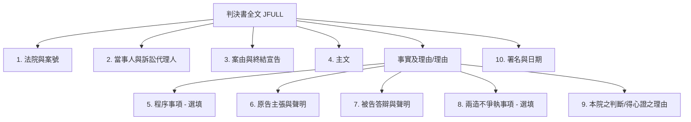

# 判決書真實資料結構分析報告

為了評估判決書真實文字的區塊拆解可行性，我們從 `data/202604` 資料夾中抽樣並詳細閱讀了 **10 筆真實判決書 JSON 資料**，涵蓋了地方法院一審（民事）、高等法院二審（民事）、最高法院三審（民事、刑事）等不同層級與類型的判決。

---

## 1. 抽樣之 10 筆真實判決書清單

我們依序調閱並完整分析了以下 10 筆判決書（主要讀取其 `JFULL` 欄位文字）：

1. **[TPDV,111,消,17](file:///c:/PythonSideProjects/Neo4j-GraphRAG/data/202604/臺灣臺北地方法院民事/TPDV,111,消,17,20260430,1.json)**：臺北地院民事一審（消費者保護糾紛 - 護理之家 MRSA 感染）
2. **[TPDV,113,勞訴,270](file:///c:/PythonSideProjects/Neo4j-GraphRAG/data/202604/臺灣臺北地方法院民事/TPDV,113,勞訴,270,20260430,1.json)**：臺北地院民事一審（勞資糾紛 - 展業主管扣薪爭議）
3. **[TPDV,111,訴,338](file:///c:/PythonSideProjects/Neo4j-GraphRAG/data/202604/臺灣臺北地方法院民事/TPDV,111,訴,338,20260430,1.json)**：臺北地院民事一審（漏水修復糾紛）
4. **[TPDV,112,建,195](file:///c:/PythonSideProjects/Neo4j-GraphRAG/data/202604/臺灣臺北地方法院民事/TPDV,112,建,195,20260430,1.json)**：臺北地院民事一審（火災損害賠償糾紛）
5. **[TPDV,112,訴,4339](file:///c:/PythonSideProjects/Neo4j-GraphRAG/data/202604/臺灣臺北地方法院民事/TPDV,112,訴,4339,20260410,1.json)**：臺北地院民事一審（給付廣告行銷費糾紛）
6. **[SLDV,111,訴,285](file:///c:/PythonSideProjects/Neo4j-GraphRAG/data/202604/臺灣士林地方法院民事/SLDV,111,訴,285,20260430,1.json)**：士林地院民事一審（請求減少土地價金糾紛）
7. **[PCDV,110,訴,1461](file:///c:/PythonSideProjects/Neo4j-GraphRAG/data/202604/臺灣新北地方法院民事/PCDV,110,訴,1461,20260422,4.json)**：新北地院民事一審（塗銷抵押權變更登記糾紛）
8. **[TPHV,110,上,625](file:///c:/PythonSideProjects/Neo4j-GraphRAG/data/202604/臺灣高等法院民事/TPHV,110,上,625,20260401,1.json)**：臺灣高等法院民事二審（分割共有物上訴案）
9. **[TPSV,113,台上,2221](file:///c:/PythonSideProjects/Neo4j-GraphRAG/data/202604/最高法院民事/TPSV,113,台上,2221,20260402,1.json)**：最高法院民事三審（過失致死損害賠償上訴案）
10. **[TPSM,113,台上,4916](file:///c:/PythonSideProjects/Neo4j-GraphRAG/data/202604/最高法院刑事/TPSM,113,台上,4916,20260402,1.json)**：最高法院刑事三審（妨害性自主上訴案）

---

## 2. 真實資料結構與您的假設對比分析

綜合這 10 筆資料，我們將您的假設結構與實務判決書文字進行比對，主要發現如下：

### 2.1 吻合的部分 (完全一致)
* **前置區塊**：所有判決書開頭均以 `XX法院民事/刑事判決` 起始，緊接著是 `XX年度XX字第XX號`（案號）。
* **當事人與關係人**：之後必定會詳細列出 `原告`、`被告`、`訴訟代理人`、`法定代理人` 等關係人姓名與律師名稱。
* **案由說明**：會以 `上列當事人間請求XXX事件...判決如下：`（案由與終結時間）作為主文前的銜接。
* **主文區塊**：緊接在 `主文` 標題之下，列出判決結果（例如：被告應給付原告...、原告之訴及假執行之聲請均駁回）。
* **事實及理由開頭**：主文之後一定會以 `事實及理由` 或 `理由` 作為大標題，開始進行詳細文字說明。
* **原告/被告主張與聲明**：在實體部分，均會明確有 `一、原告主張：`（或 `原告起訴主張...`）及 `二、被告則以：`（或 `被告答辯以...`），且結尾必定會交代各自的 `聲明`。

### 2.2 存在變數與差異的部分 (開發時需特別注意)

#### 變數 1：`壹、程序事項` 與 `貳、實體事項` 不是每筆都有
在您的假設中，結構有明分 `壹、程序事項` 與 `貳、實體事項`。在真實資料中：
* **有程序爭議時**（如原告有追加或減縮聲明、當事人變更、承受訴訟等）：確實會切分出 `壹、程序事項/程序方面` 和 `貳、實體事項/實體方面`。例如：
  * **[TPDV,111,訴,338](file:///c:/PythonSideProjects/Neo4j-GraphRAG/data/202604/臺灣臺北地方法院民事/TPDV,111,訴,338,20260430,1.json)**、**[TPDV,112,訴,4339](file:///c:/PythonSideProjects/Neo4j-GraphRAG/data/202604/臺灣臺北地方法院民事/TPDV,112,訴,4339,20260410,1.json)**、**[PCDV,110,訴,1461](file:///c:/PythonSideProjects/Neo4j-GraphRAG/data/202604/臺灣新北地方法院民事/PCDV,110,訴,1461,20260422,4.json)**。
* **無程序爭議時**：判決書會**直接省略** `壹、程序事項` 這兩個大字，直接從 `一、原告主張` 開始。例如：
  * **[TPDV,111,消,17](file:///c:/PythonSideProjects/Neo4j-GraphRAG/data/202604/臺灣臺北地方法院民事/TPDV,111,消,17,20260430,1.json)**、**[TPDV,113,勞訴,270](file:///c:/PythonSideProjects/Neo4j-GraphRAG/data/202604/臺灣臺北地方法院民事/TPDV,113,勞訴,270,20260430,1.json)**。
* **有程序變更但未用「壹、貳」標題**：有時會直接把程序事項當作「事實及理由」下的第一項 `一、...`，而實體的主張順延為 `二、...`。例如：
  * **[TPDV,112,建,195](file:///c:/PythonSideProjects/Neo4j-GraphRAG/data/202604/臺灣臺北地方法院民事/TPDV,112,建,195,20260430,1.json)** (第一項 `一、原告法定代理人...變更為...承受訴訟...`，第二項 `二、原告主張...`，第三項 `三、被告則以...`)。

> [!WARNING]
> **解析建議**：我們不能只用 `壹、程序事項` 和 `貳、實體事項` 的關鍵字來做硬切割。解析程式需要先判斷有沒有這兩個大標。如果沒有，則要將 `事實及理由` 之後的編號 `一` 直接視為 `原告主張`，編號 `二` 視為 `被告答辯`。

#### 變數 2：實體事項底下的子區塊 `(一)(二)(三)` 並非固定格式
在您的假設中，原告主張下細分了 `(一)法條依據`、`(二)事實內容`、`(三)原告訴求`。
* **實務狀況**：法官在撰寫原告主張與被告答辯時，通常是**以大段文字融合敘述**（可能用 ㈠㈡㈢ 分段，也可能沒分），將事實、法條與理由寫在一起，最後用 `並聲明：...` 來交代訴求。
* 很少會有標準的 `(一)法條依據` 這樣的固定字眼。

> [!TIP]
> **解析建議**：若要將原告主張細拆成「法條」與「事實」，用正規表示式（Regex）去切字元通常行不通，這部分在實體抽取階段，非常適合交由 **LLM (大語言模型)** 進行語義分析與欄位提取，而不用在字串分割（String Split）階段強行去切。

#### 變數 3：實務上極常出現的關鍵區塊：`兩造不爭執事項`
在我們閱讀的真實資料中（例如：[TPDV,111,消,17](file:///c:/PythonSideProjects/Neo4j-GraphRAG/data/202604/臺灣臺北地方法院民事/TPDV,111,消,17,20260430,1.json)、[TPDV,113,勞訴,270](file:///c:/PythonSideProjects/Neo4j-GraphRAG/data/202604/臺灣臺北地方法院民事/TPDV,113,勞訴,270,20260430,1.json)、[TPDV,112,建,195](file:///c:/PythonSideProjects/Neo4j-GraphRAG/data/202604/臺灣臺北地方法院民事/TPDV,112,建,195,20260430,1.json) 等），在原告主張與被告答辯之後，法官通常會列出：
* **`三、兩造不爭執事項：`** 或 **`三、經查...（不爭執事項）`**
* 這部分非常整齊地列出雙方都同意的客觀事實，對於我們系統建構知識圖譜（提取無爭議事實關係）具有極高價值。

#### 變數 4：`本院之判斷` 通常稱為 `得心證之理由`
在判決書的後半段，法官的認定區塊最常見的標題是：
* **`本院之判斷：`** 或 **`得心證之理由：`**
* 底下會分 `㈠`、`㈡`、`㈢` 等大項。在這些子項中，法官會將法律依據（法條）和事實認定穿插在同一個段落裡進行論證，並不會特別切分成 `(一)法條`、`(二)認定事實` 兩個獨立區域。

---

## 3. 不同案件類型的結構差異 (重要架構限制)

當我們把抽樣範圍擴大到「最高法院（三審）」與「刑事案件」時，結構有極大不同：

| 判決書層級/類型 | 結構特徵 | 能否套用民事一二審拆解邏輯？ |
| :--- | :--- | :--- |
| **地方法院/高等法院 (民事一二審)** | 法院 -> 當事人 -> 主文 -> 事實及理由 -> 原告主張/被告主張/不爭執事項/得心證理由 | **可以**。結構非常公式化，最適合進行區塊拆解。 |
| **最高法院 (民事三審)** | 法院 -> 當事人 -> 主文 -> 理由 (一、上訴人主張；二、原審判決；三、本院法律心證) | **不行**。最高法院是法律審，它主要是在評斷「原審判決」是否違法，因此其「理由」是摘要原審與進行法律辯論，沒有一審那種程序/實體主張的結構。 |
| **刑事判決書 (各層級)** | 法院 -> 被告 -> 選任辯護人 -> 主文 -> 事實 -> 理由 (證據能力、心證、量刑理由) | **不行**。刑事訴訟沒有「原告主張」、「被告訴求」等民事對立概念，而是「公訴人（檢察官）起訴事實」與「被告抗辯」，且通常會先有獨立的 `犯罪事實` 區塊，再有 `理由` 區塊。 |

---

## 4. 建議之 JSON 區塊拆解邏輯設計

如果我們要把 `JFULL` 的大文本拆解成多個區塊以利後續的 Graph RAG 處理，建議將解析邏輯調整為以下結構：

### 區塊拆解定位點 (以 Regular Expression 或文字定位)：
1. **主文區塊**：定位在 `主文` 與 `事實及理由`（或 `理由`）之間。
2. **事實及理由區塊**：定位在 `事實及理由` 之後到 `中　　華　　民　　國...`（結尾日期）之前。
3. **程序事項/實體事項**：
   * 若有 `壹、程序`，則拆分 `壹` 到 `貳` 之間為程序事項。
   * `貳、實體事項` 之後，或無程序事項時的 `事實及理由` 之後，依序尋找：
      * **`原告主張`**（通常為 `一、` 或 `甲、` 起頭）
      * **`被告答辯`**（通常為 `二、` 或 `乙、` 起頭）
      * **`不爭執事項`**（選填，通常為 `三、`）
      * **`本院之判斷 / 得心證之理由`**（通常為 `三、` 或 `四、` 起頭）

---

## 5. 90 筆真實判決書（民、刑、行各 30 筆）普查結果

我們於 2026-06-19 撰寫腳本，對民事、刑事、行政三大類各 30 筆真實「判決（Judgment）」大文本進行了正則特徵統計，主要發現如下：

### 5.1 統計數據表 (民事、刑事、行政各 30 筆判決書)

我們已將詳細的 JID 分析紀錄與偵測到的行數細節存放在 [docs/analysis_results.json](file:///c:/PythonSideProjects/Neo4j-GraphRAG/docs/analysis_results.json)。以下是各類型判決書中，依正則表達式偵測到特定結構區塊的比例統計：

| 結構區塊 (Section Type) | 民事判決 (30 筆) | 刑事判決 (30 筆) | 行政判決 (30 筆) | 備註說明 |
| :--- | :---: | :---: | :---: | :--- |
| **`proc` (程序事項)** | 73.3% (22筆) | 23.3% (7筆) | 63.3% (19筆) | 處理當事人變更、管轄權或程序爭議 |
| **`facts_summary` (事實概要)** | 0.0% (0筆) | 0.0% (0筆) | 16.7% (5筆) | 行政訴訟特有，交代處分與訴願歷程 |
| **`plaintiff_claim` (原告主張)** | 40.0% (12筆) | 0.0% (0筆) | 83.3% (25筆) | 民事與行政原告訴求與聲明 |
| **`defendant_response` (被告答辯)** | 36.7% (11筆) | 3.3% (1筆) | 83.3% (25筆) | 被告防禦與答辯理由 |
| **`uncontested` (不爭執事項)** | 20.0% (6筆) | 0.0% (0筆) | 0.0% (0筆) | 民事中雙方合意的客觀事實 |
| **`court_reasoning` (得心證理由)** | 100.0% (30筆) | 100.0% (30筆) | 100.0% (30筆) | 法院最終的法律評斷與心證 |
| **`crime_facts` (事實/犯罪事實)** | 100.0% (30筆) | 70.0% (21筆) | 93.3% (28筆) | 刑事的起訴犯罪事實或通用事實段落 |
| **`evidence_ability` (證據能力)** | 0.0% (0筆) | 20.0% (6筆) | 0.0% (0筆) | 刑事訴訟對證據適法性的評判 |
| **`sentencing` (論罪科刑)** | 0.0% (0筆) | 53.3% (16筆) | 0.0% (0筆) | 刑事對罪名適用與量刑的論述 |
| **`confiscation` (沒收)** | 0.0% (0筆) | 46.7% (14筆) | 0.0% (0筆) | 刑事對犯罪所得或工具沒收的說明 |

### 5.2 核心發現與 Schema 設計決定
1. **刑事案件的特異性**：刑事訴訟沒有民事/行政中原告、被告對立主張的結構，而是以 `犯罪事實` 為核心，理由區塊中穿插 `證據能力`、`論罪科刑`、`沒收` 項目。
2. **民事案件子標題缺失**：在簡單的民事案件中，有近 60% 的判決書沒有使用獨立子標題區分原告與被告，而是直接寫在 `事實及理由` 第一大段內。
3. **行政案件的高格式化**：行政訴訟案件格式最為嚴整，五段式結構（程序、事實概要、原告主張、被告答辯、本院之判斷）非常清晰。
4. **設計結論**：採用統一的 `(:Section)` 節點標籤，並配合屬性 `role` (plaintiff/defendant/court/prosecutor) 與 `type` (facts/facts_summary/claims/uncontested/reasoning/evidence_ability/sentencing/confiscation) 是最完美的通用設計。針對沒有標題的判決，將啟動 Fallback 兜底機制，將整個 `事實及理由` 作為單一的 `reasoning` 區塊存入，以防漏字。
