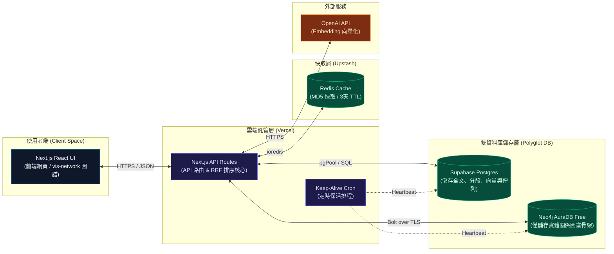
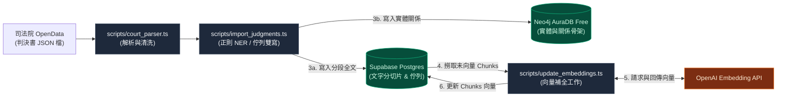
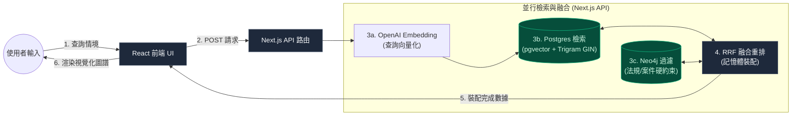

# 法律判決書 Graph RAG 搜尋與分析系統 — 專案規格說明書 (project.md)

本文件作為此專案的「世界觀（Global Context / Worldview）」與核心規格說明，旨在讓所有 AI 協同開發助手能快速且精確地理解本專案的設計哲學、架構組成與開發規範。

---

## 1. 專案概述

### 1.1 目標
建構一個基於 **PostgreSQL (Supabase)**、**Neo4j AuraDB Free 圖資料庫**、**Next.js (Vercel)** 與 **大語言模型 (LLM)** 的智慧型法律判決書搜尋與知識圖譜分析系統。

### 1.2 核心價值
* **混合式搜尋**：結合向量相似度檢索（針對犯罪情境描述）與圖譜路徑推理（針對法條引用、罪名關聯與法院層級篩選）。
* **極致省錢部署**：
  * **前端與後端 API**：完全託管於 Vercel 的免費額度中，使用 Next.js Serverless Route Handlers，免除租用獨立 Python 伺服器的固定成本。
  * **圖文分離 (Polyglot Decoupling) 架構**：將重文本與 1536 維向量存於 PostgreSQL，僅將實體關係骨架存於 Neo4j，最大化利用免費資源上限，徹底打破 Neo4j AuraDB Free 20 萬節點的限制。

---

## 2. 系統架構

專案採用 **圖文分離 雙資料庫** 的全棧 Next.js 應用程式架構，系統結構包含靜態元件與動態運行流程：

### 2.1 系統靜態元件架構 (Static Component Architecture)

本系統採用 **圖文分離 (Polyglot Decoupling)** 雙資料庫架構，靜態拓撲由左至右分為四大層級：

* **使用者端 (Client Space)**：Next.js React 互動式搜尋網頁、`vis-network` 拓撲圖譜展示。
* **雲端託管層 (Serverless Backend)**：API 路由與排序核心、定時保活排程（Keep-Alive Cron）。
* **快取層 (Cache Layer)**：Upstash Redis 快取、MD5 雜湊查詢鍵值映照。
* **雙資料庫儲存層 (Decoupled DB Layer)**：
  * **PostgreSQL (Supabase)**： judgments 全文表、sections 分段表、chunks 向量表與 sync_jobs 任務佇列表。
  * **Neo4j AuraDB Free**：僅保留輕量 Judgment 骨架與關聯實體（Person, Law, Crime, Item）之圖譜結構。
* **外部 API**：OpenAI Embedding API。

---

### 2.2 資料流向與運行流程 (Dynamic Data Flow & Pipelines)

為避免複雜的線條交錯，動態運行流程拆分為**「數據匯入雙寫」**與**「混合搜尋檢索」**兩大管線：

#### A. 數據增量雙寫流水線 (Data Ingestion Pipeline)
此流水線負責將原始判決書解析、提取實體並同步寫入兩個獨立的資料庫：

* **正則 NER 實體分析**：基於規則提取法條、罪名、事證與當事人。
* **佇列緩衝與批次寫入**：先掃描登錄待處理任務，以併發限制 = 2 分批寫入雙庫防範死鎖。
* **圖譜社群著色**：手動或從後台觸發 LPA 社群劃分演算法，並回填 Neo4j 著色。

#### B. 語義與篩選混合檢索管線 (Hybrid Search Pipeline)
此管線負責在使用者發送自然語言請求時，並行查詢雙資料庫並在記憶體重排裝配：

* **快取層前置判定**：對搜尋參數進行 MD5 Hash，智慧過濾，快取命中直接秒級回傳。
* **分散式並行檢索**：Postgres 進行 Cosine 向量 + Trigram GIN 全文搜尋；Neo4j 進行關係路徑過濾與多跳案例推薦。
* **結果融合與排序**：在 Node.js 中進行 RRF 分數融尊重排，撈取長文本組裝回傳。

#### C. 資料庫定時保活流水線 (Keep-Alive Cron)
* Vercel Cron 每 2 天定時觸發，對 Neo4j 與 Postgres 寫入心跳，防止休眠。

---

### 2.3 數據導入與任務佇列模組 (Data Ingestion & Jobs Queue)
* **增量任務佇列 (Jobs Queue)**：使用 `verdict_sync_jobs` 資料庫表作為佇列，登錄本地的判決書檔案同步任務，支援狀態追蹤（Pending、Processing、Completed、Failed）與錯誤日誌記錄。
* **管理後台與 API 管道**：
  * `/admin`：提供現代化維運儀表板，可即時監控任務佇列狀態、一鍵重試失敗任務、手動觸發檔案登錄、執行雙寫同步與社群重新偵測。
  * `/api/admin/sync`：執行雙資料庫雙寫 Ingestion，並透過手寫併發限制池（Concurrency = 2）來防範 Neo4j AuraDB 免費版發生死鎖（Deadlock），並支援 `ENABLE_AUTO_SYNC` 環境變數保險。
  * `/api/admin/jobs`：提供佇列統計數據與失敗任務批次重置。
  * `/api/admin/community-detection`：提供手動 LPA 社群傳播演算法重新運算，回填節點 `community` 屬性。
  * `check_locks.ts`：提供活動連線診斷，可用於強制終止資料庫卡死的 zombie transactions。

### 2.4 實體與關係擷取 (NER)
* 從判決全文中辨識出重要實體：
  * **人名 (Person)**：被告、原告、法官、律師、證人。
  * **引用法條 (Law)**：如刑法第185-3條。
  * **涉及罪名 (Crime)**：如公共危險罪、過失致死罪。
  * **關鍵事證 (Item)**：如呼氣酒精濃度、凶器等。

### 2.5 搜尋與圖譜檢索模組
* **向量檢索**：將使用者的「自然語言情境描述」轉為 1536 維 Embedding，在 PostgreSQL 中使用 pgvector 檢索最相似的 `chunks` 節點。
* **全文檢索**：在 PostgreSQL 中使用 GIN 索引與 Trigram 進行中文 ILIKE 全文模糊加速。
* **關係擴展**：檢索出相似判決後，在 Neo4j 中延展出其高度關聯的引用法條、法官、罪名，並走訪共享法規推薦二跳相似案件。

### 2.6 快取檢索機制 (Redis Cache Layer)
* **快取讀寫流**：API 接收到搜尋請求時，以查詢字串與過濾參數的組合進行 MD5 Hash 生成唯一的 Cache Key `search:cache:<hash>`。
* **讀取優先**：優先從 Upstash Redis 讀取，若命中則直接回傳（整體 API 耗時 <20ms）；若未命中則執行即時混合檢索，並將結果非同步寫入 Redis（設定 TTL 為 3 天）。

---

## 3. 資料庫 Schema 設計

### 3.1 PostgreSQL 實體表
* **`judgments` (主表)**：儲存判決書基本 metadata、`main_text` (主文)、`fact_reason` (事實及理由全文)。
* **`sections` (段落表)**：儲存拆分後的段落結構與角色標記（原告主張、被告抗辯、法院見解等）。
* **`chunks` (切片表)**：儲存文字切片，並配置 `embedding` 欄位為 `VECTOR(1536)`。
* **`verdict_sync_jobs` (任務佇列表)**：儲存判決書增量匯入同步任務。欄位包含 `id` (PK)、`jid` (唯一案號鍵)、`file_path` (實體檔案路徑)、`status` (任務狀態：pending/processing/completed/failed)、`error_message` (錯誤日誌)、`retry_count` (重試次數)、`created_at` 與 `updated_at`。配置 `(status, created_at)` 複合索引以利快速提取排程任務。

### 3.2 Neo4j 拓撲節點
* **`Judgment` (判決骨架)**：僅保留 `id` (PK)、`court`、`court_level`、`case_type`、`date`、`reason`。無長文本與向量。
* **`Entity` (關聯實體)**：
  * **`Person`**：法官、被告、原告、訴訟代理人。
  * **`Law`**：引用法條，如 `中華民國刑法第185-3條`。
  * **`Crime`**：涉及罪名，如 `公共危險`、`過失傷害`。
  * **`Item`**：關鍵事證，如 `呼氣酒精濃度`、`安非他命`、`西瓜刀`。

### 3.3 關係與索引策略
* **PostgreSQL 索引**：
  * 對 `judgments` 表的 `main_text` 與 `fact_reason` 欄位建立 `gin_trgm_ops` 索引以提供三連字元全文模糊檢索加速。
  * 針對 `chunks(embedding)` 建立 `hnsw` 索引搭配 `vector_cosine_ops` 進行向量快速查詢。
* **Neo4j 索引**：
  * 對 `Judgment(id)`、`Law(name)`、`Person(name)`、`Crime(name)`、`Item(name)` 建立唯一性約束（Unique Constraint）。

---

## 4. 開發與部署規範

### 4.1 開發工作流
1. 所有的代碼結構、API 行為、資料庫架構異動，皆需先利用 OpenSpec CLI 發起 Proposal 規格書，並在 `openspec/` 下進行管理。
2. 敏感變更或資料庫連接字串（如 `DATABASE_URL`, `NEO4J_URI`, `NEO4J_PASSWORD`, `OPENAI_API_KEY`）一律配置於 `.env.local` 中，且絕對不得提交至版本控制系統。

### 4.2 語系規範
* 本專案的程式碼註解、變數命名說明、介面文案、說明文件等，**一律採用繁體中文 (Traditional Chinese)**。
